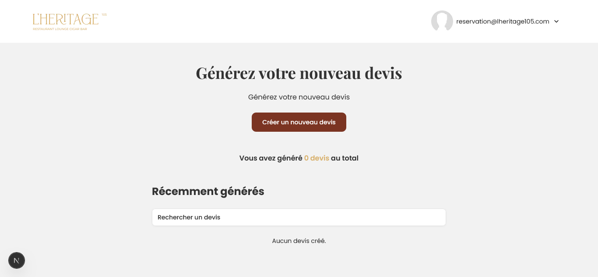
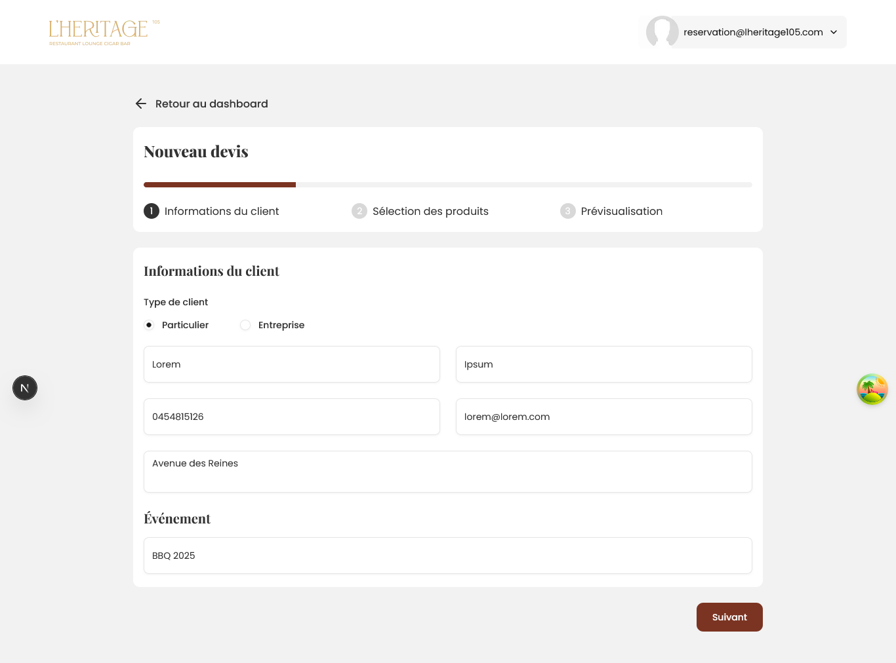
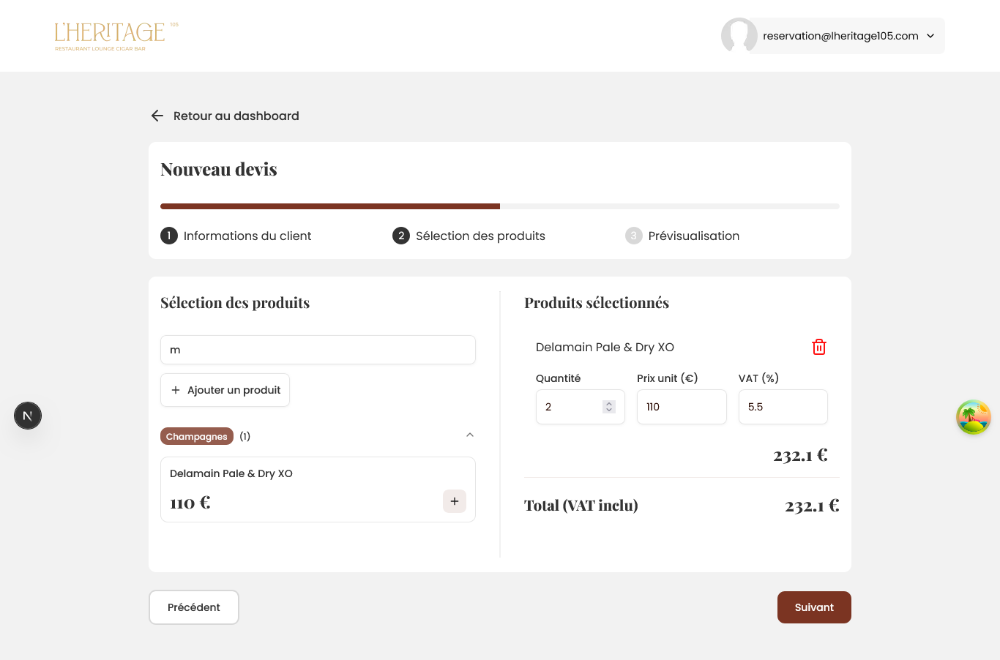
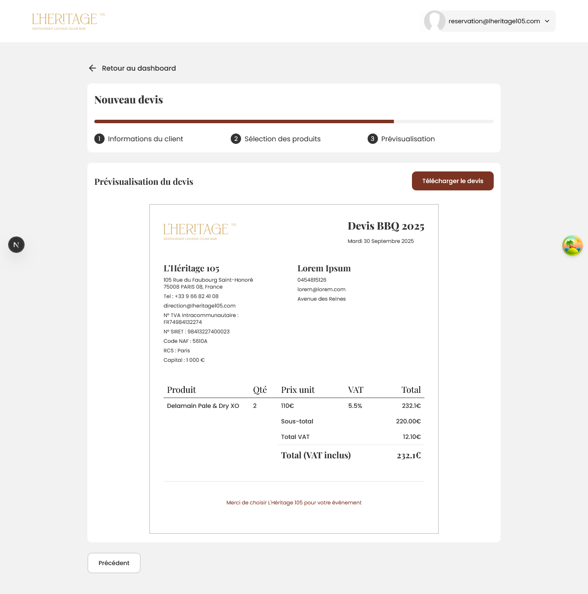

# Devis Express: Next.js + Strapi (Monorepo)

Application web de génération de devis conçue avec Next.js et Strapi.

## Stack Technique

- Frontend: Next.js 15, React 19, Tailwind CSS 4, Typescript, ShadCN UI & React Hook Form, Tanstack Query, html2pdf
- CMS/API: Strapi 5 (SQLite by default)
- Runtime: Node 20+ (containers use Alpine images)
- Package manager: Yarn (Corepack)
- Dev Containers: Docker Compose (two services: `web`, `content`)

## Requirements

- Yarn via Corepack (`corepack enable`)
- Docker

## Quick Start

```bash
# Depuis la racine du projet
docker compose up --build
```

- Web (Next.js): http://localhost:3000
- CMS (Strapi): http://localhost:1337
- Strapi Admin: http://localhost:1337/admin (créer le premier admin lors de la première visite)

## Instructions de démarrage

- Créer le compte admin et s'assurer que le backend a bien démarré
- Aller dans "Settings" > "Users & Permissions plugin" > "Roles" et activer les permissions de lecture (find & findOne) et d'écriture (create) sur "Quote" et "Product" pour l'utilisateur non authentifié (Public)
- Ensuite, accéder au site pour voir la liste des devis et commencer la génération de nouveaux devis

## Tester l'application

- Sur la page d'accueil, cliquer sur "Créer un nouveau devis" pour créer un devis
- Une fois sur la page de création du devis -- étape 1 (Informations du client), remplir les différents champs avec les informations demandées.
- À l'étape 2 (Sélection des produits), s'il s'agit de la première visite, ajouter un nouveau produit en cliquant sur le bouton correspondant. Ensuite, le rechercher via la barre de recherche et le sélectionner pour l'ajouter au devis.
- Enfin, à l'étape 3 (Prévisualisation), vérifier si toutes les informations fournies sont fidèlement réflétées sur la page et télécharger le devis dès que c'est bon.
- Le téléchargement s'effectue alors et le document s'ouvre dans un nouvel onglet dès qu'il est prêt.

- Lors du clic sur le bouton de téléchargement, une requête est lancée pour enregistrer le devis dans la base de données. Dès que le devis est enregistré, vous êtes redirigé sur la page d'accueil et vous pouvez y voir votre nouveau devis.

- Félicitations, vous venez de créer votre tout premier devis 🎉

## Variables d'Environnement

- `web/`

  - `NEXT_PUBLIC_API_URL` (public): URL of the Strapi API.

- `content/` (Strapi)
  - `APP_KEYS`: CSV of app keys (required by Strapi)
  - `API_TOKEN_SALT`, `ADMIN_JWT_SECRET`, `TRANSFER_TOKEN_SALT`
  - `DATABASE_CLIENT`: defaults to `sqlite` (see `content/config/database.ts`)
  - `HOST`, `PORT`: defaults to `0.0.0.0:1337` (see `content/config/server.ts`)

## Captures d'écran

### Page d'accueil



### Créer un devis -- Step 1



### Créer un devis -- Step 2



### Créer un devis -- Step 3


